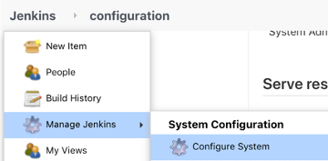
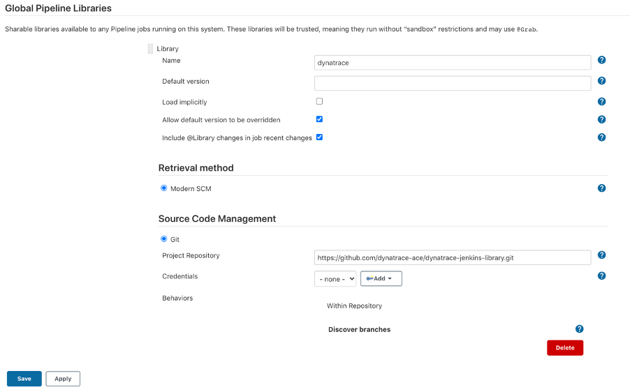

# Overview

Jenkins shared library for test executions

## Usage

The directive `@Library('jenkinstest@main')` is added to the top of a Jenkinsfile script to load the latest version of the Jenkins Test Library. Then within the various pipeline stages, Test library functions are called with the required and optional parameters.

Library versions are listed below:  

| Library Version | Comment |
| --------------- | ------- |
| v1.0 | Initial Release |
| v1.1 | Support for new runner and dynamic jmeter path |
| v1.2 | Added Helpers.waitForDeployment |


*It is recommended to specify the library version in the Jenkinsfile to ensure pipeline stability. For example `@Library('jenkinstest@v1.0')`*

## Library functions:

### Execute Jmeter Test
  * Supporting function that allows to run jmeter tests from Jenkins. This function assumes we run on a Jenkins Agent that has JMeter installed in `/opt/jmeter`

### Helpers - wait for deployment to be ready
  * Supporting function that waits for a deployment in a namespace to be ready. This function assumes we run on a Jenkins Agent that has `kubectl` available

Once you have everything configured use it in your Jenkins Pipeline like this

```groovy

// Import Dynatrace library -- the v1.0 indicates the tag/branch to use.
@Library("jenkins-test@v1.0")

// Initialize the class with the event methods
def jmeter = new com.dynatrace.ace.Jmeter()
def helpers = new com.dynatrace.ace.Helpers()

// this is called with a script step
pipeline {
  agent myagent
  stages {
    stage('Run health check in dev') {
      steps {
        container('kubectl') {
          script {
            def status = helpers.waitForDeployment (
              deploymentName: "myapp",
              environment: 'dev'
            )
            if(status !=0 ){
              currentBuild.result = 'FAILED'
              error "Deployment did not finish before timeout."
            }
          }
        }
      }
    }
    
    
    stage('Run performance test') {
      steps {
        container('jmeter') {
          script {
            def status = jmeter.executeJmeterTest ( 
                scriptName: "jmeter/simplenodeservice_load.jmx",
                resultsDir: "perfCheck_${env.APP_NAME}_staging_${BUILD_NUMBER}",
                serverUrl: "simplenodeservice.staging", 
                serverPort: 80,
                checkPath: '/health',
                vuCount: env.VU.toInteger(),
                loopCount: env.LOOPCOUNT.toInteger(),
                LTN: "perfCheck_${env.APP_NAME}_${BUILD_NUMBER}",
                funcValidation: false,
                avgRtValidation: 4000,
                jmeterBaseDir: "/opt/jmeter" // This is the default, it can be overwritten by changing this variable
            )
            if (status != 0) {
                currentBuild.result = 'FAILED'
                error "Performance test in staging failed."
            }
          }
        }
      }
    }
  }
}

```

# Setup

## Prerequisites

**#1 - Jenkins server**  

You may have your own, but if not one option is to run Jenkins as [Docker container](https://github.com/jenkinsci/docker/blob/master/README.md).  This command will start it up and prompt for setting up initial user and default plugins.
```
docker run -p 8080:8080 -p 50000:50000 -v jenkins_home:/var/jenkins_home jenkins/jenkins:lts
```

**#2- Jmeter available in /opt/jmeter/bin**
The library assumes it is being run on a runner that has jmeter.sh installed in `/opt/jmeter/bin`

## Install and configure the Dynatrace Jenkins Library

1. Login to Jenkins 
1. Navigate to Manage Jenkins > Configure System

    

1. Find the **Global Pipeline Libraries** section, click add new and fill in as shown below

    * Select **Git** as the type
    * Project repository = https://github.com/dynatrace-ace/jenkins-test-library.git

    

# Support

If you’d like help with this pipe, or you have an issue or feature request, let us know. The repo is maintained by Dynatrace. You can contact us directly at ace@dynatrace.com.

If you’re reporting an issue, please include:

* the version of the pipe
* relevant logs and error messages
* steps to reproduce
